いつも賑わってる印象です。  
最寄り駅：長者原  
福岡県糟屋郡粕屋町原町５丁目３−8   
トイレ：あり。 オムツ替え不可。   
　  
## 特徴
結構広くていい感じです。  
野球・サッカーといった団体スポーツもできます。  

## 入口
  

## 遊具１
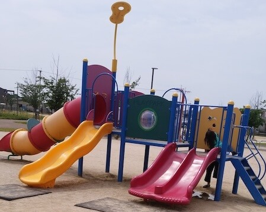  
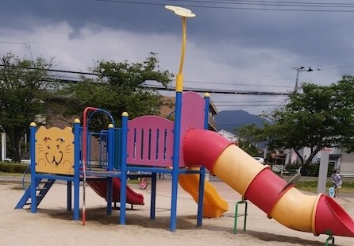  

## 遊具２
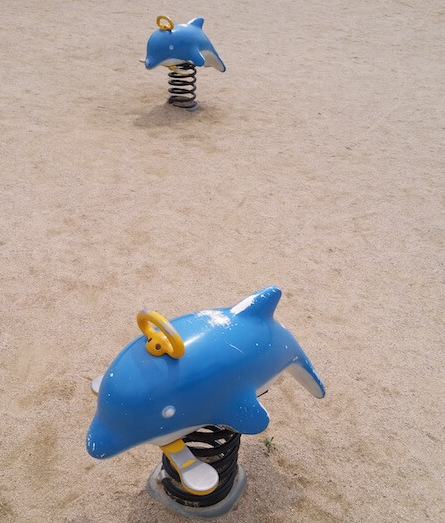  

## 鉄棒
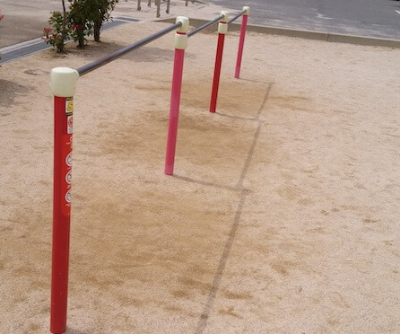  

## 広場
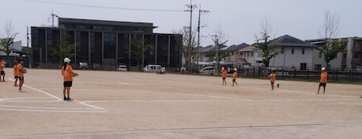  

## 健康器具
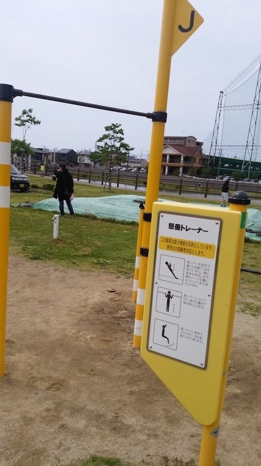  

## ベンチ
  
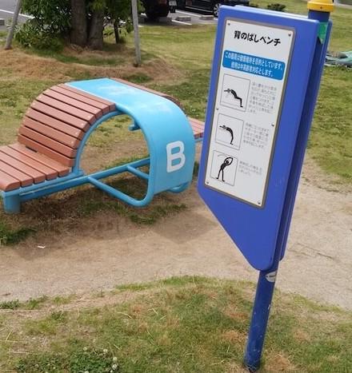  
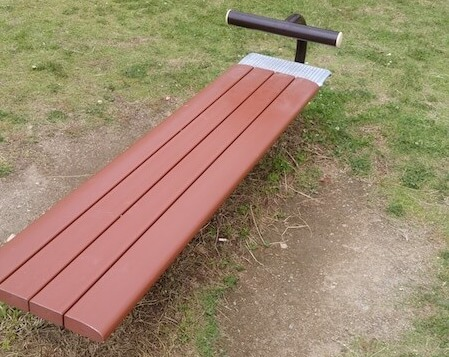  

## 風景
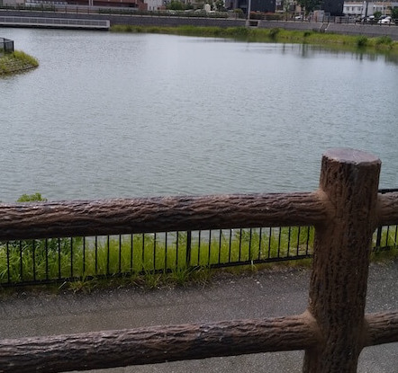  
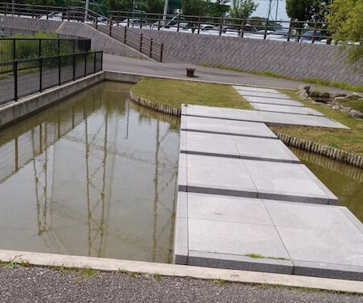  
  

## トイレ
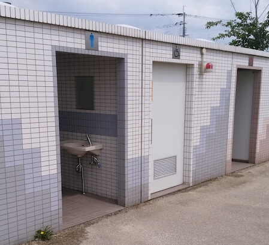  

## 地図
<iframe src="https://www.google.com/maps/embed?pb=!1m18!1m12!1m3!1d3322.5703234881967!2d130.46528941520353!3d33.616451380726716!2m3!1f0!2f0!3f0!3m2!1i1024!2i768!4f13.1!3m3!1m2!1s0x35418f88b7eb5e67%3A0x980325116759a0eb!2sOike!5e0!3m2!1sen!2sjp!4v1562515842672!5m2!1sen!2sjp" width="600" height="450" frameborder="0" style="border:0" allowfullscreen></iframe>
