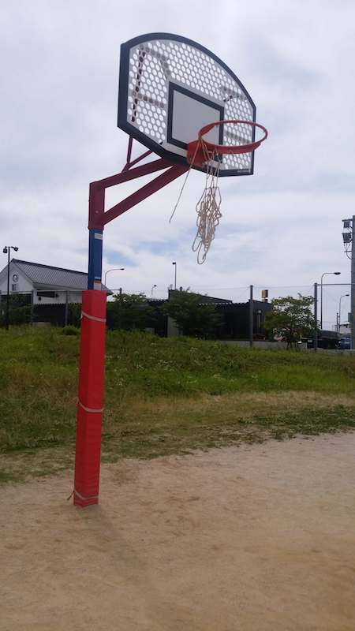

バスケットのゴールがあります。  
最寄り駅：柚須  
福岡県福岡市東区二又瀬２１   
トイレ：あり。 オムツ替え不可。   
　  
## 特徴
遊具とかは特に無いです。  
  

## 入口
  

## バスケットゴール
  
  

## 広場
  
  

## ベンチ
  

## トイレ
  

## 地図
<iframe src="https://www.google.com/maps/embed?pb=!1m14!1m8!1m3!1d26583.932065776557!2d130.4329793!3d33.6055248!3m2!1i1024!2i768!4f13.1!3m3!1m2!1s0x35418fd119256a73%3A0x6d1f96b9a33c8912!2z5LqM5Y-I54Cs6YGL5YuV5bqD5aC0!5e0!3m2!1sen!2sjp!4v1563128291491!5m2!1sen!2sjp" width="600" height="450" frameborder="0" style="border:0" allowfullscreen></iframe>
