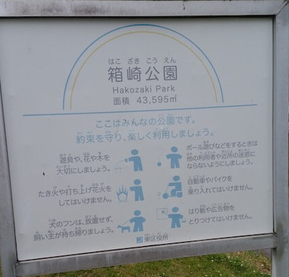
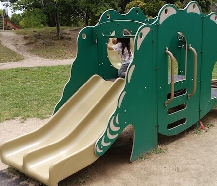

近辺で一番おすすめ。  
最寄り駅：柚須  
福岡県福岡市東区原田４丁目３３   
トイレ：あり。 オムツ替え不可。   
　  
## 特徴
めっさ広くて遊具もたくさん。  
巨大滑り台が特徴的。  
ランニングコースもあり、子供から大人まで楽しめます。  

## 入口
  
  

## 巨大すべり台
  
  
  

## ローラーすべり台
  
  

## 遊具１
  
  
  
  

## 遊具２
  
  
  

## 遊具３
  
  
  

## 遊具４
  
  

## 遊具５
  

## 遊具６
  

## ロープウェイ
  
  

## 砂場
  

## 広場
  

## ランニングコース
  

## トイレ
  

## 地図
<iframe src="https://www.google.com/maps/embed?pb=!1m14!1m8!1m3!1d3322.3495940653324!2d130.4405756!3d33.6221764!3m2!1i1024!2i768!4f13.1!3m3!1m2!1s0x35418fb76f52ab35%3A0xca648364ab69a14!2sHakozaki+Park!5e0!3m2!1sen!2sjp!4v1560706141274!5m2!1sen!2sjp" width="600" height="450" frameborder="0" style="border:0" allowfullscreen></iframe>