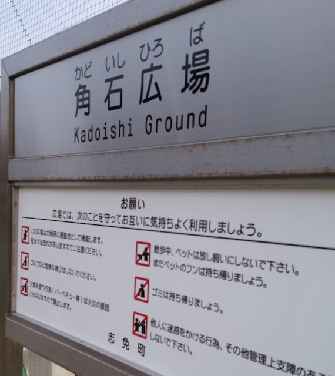
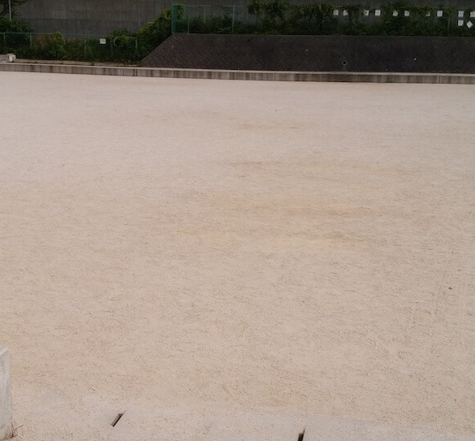
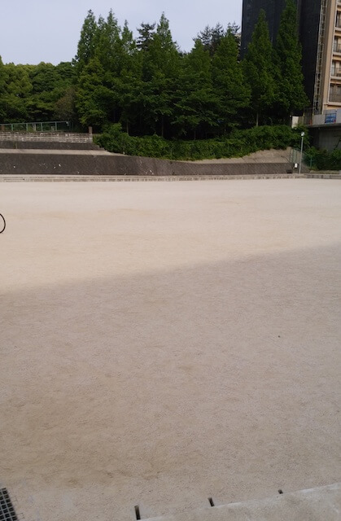
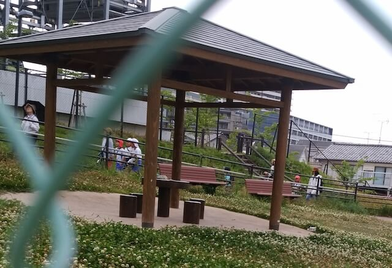

特に何もない。  
最寄り駅：柚須  
福岡県糟屋郡志免町別府西２丁目１７−６   
トイレ：なし   
　  
## 特徴
少し大きい広場が１つあるだけ。  
遊具が何もない。  
わざわざ足を運ぶ必要はなさそうです。

## 入口
  

## 広場
  
  

## ベンチ
  

## 地図
<iframe src="https://www.google.com/maps/embed?pb=!1m14!1m8!1m3!1d6646.5576413651015!2d130.4522813!3d33.5980694!3m2!1i1024!2i768!4f13.1!3m3!1m2!1s0x35418fe15613905f%3A0xc00b99ae28deff22!2z6KeS55-z5bqD5aC0!5e0!3m2!1sja!2sjp!4v1560613028753!5m2!1sja!2sjp" width="600" height="450" frameborder="0" style="border:0" allowfullscreen></iframe>
