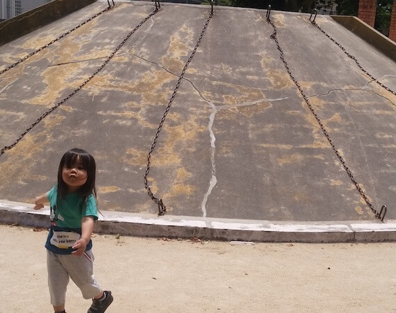
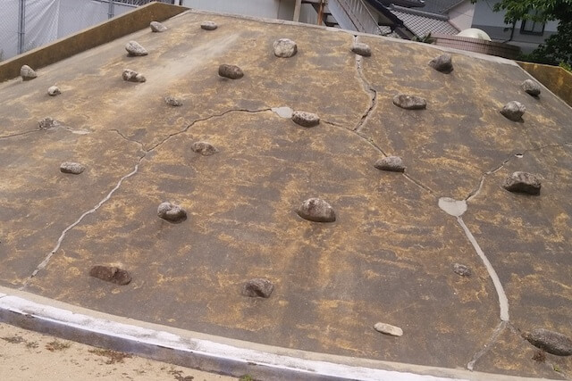
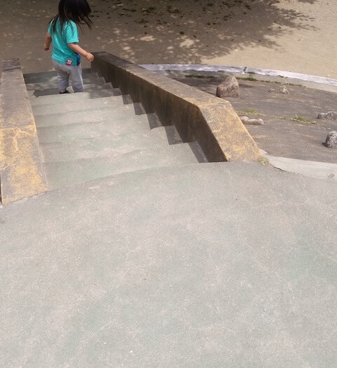
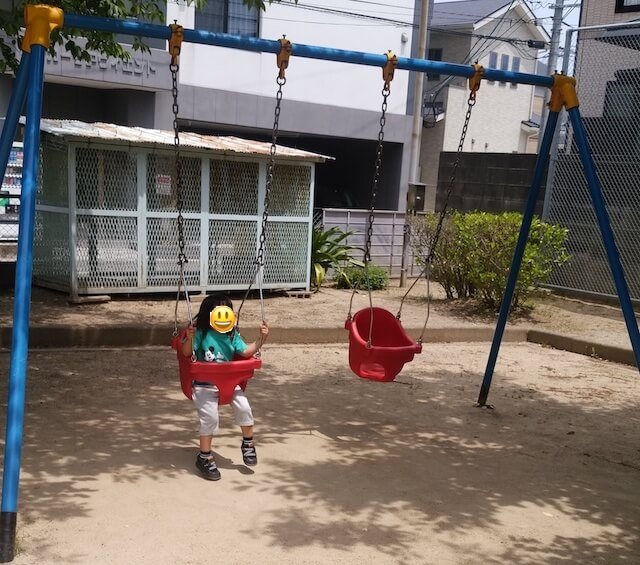
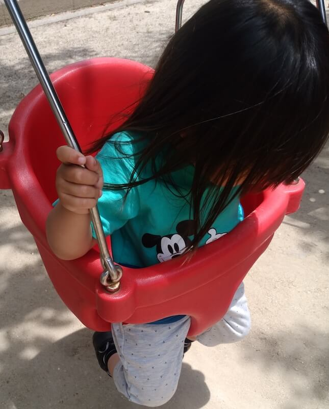
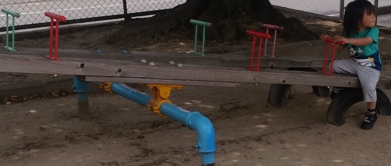
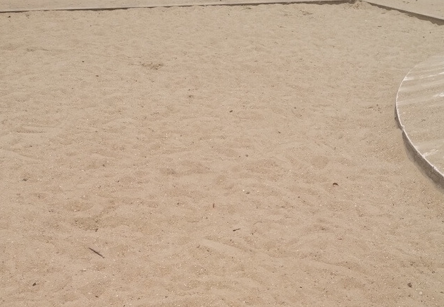
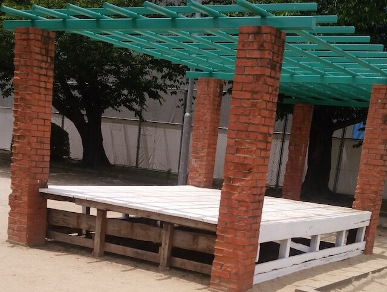
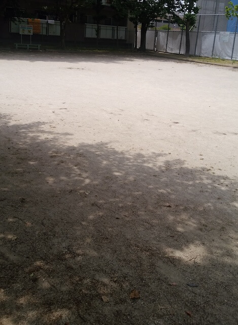
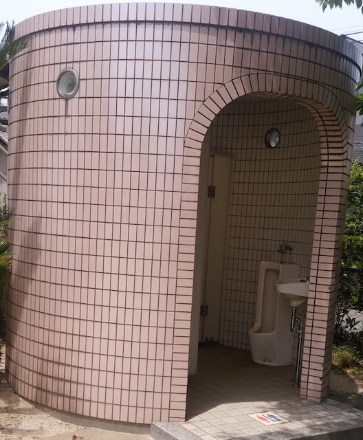

まぁまぁの広さ。  
最寄り駅：柚須  
福岡県糟屋郡志免町別府北１丁目１９  
トイレ：あり。男女共用。オムツ替え不可。   
　  
## 特徴
公園名が施設内のどこにも書いてないので、地図で調べました。  
子供が怪我しないように配慮されたブランコが特徴。

### 遊具
  
  
  

### ブランコ
  
  

### シーソー

### 砂場

### 演説台

### 広場

### トイレ

### 地図
<iframe src="https://www.google.com/maps/embed?pb=!1m18!1m12!1m3!1d6646.024577289971!2d130.45432352592562!3d33.604985622919756!2m3!1f0!2f0!3f0!3m2!1i1024!2i768!4f13.1!3m3!1m2!1s0x35418febd9906363%3A0xc296d9acc2796b0!2sKagami+Park!5e0!3m2!1sen!2sjp!4v1559494481696!5m2!1sen!2sjp" width="600" height="450" frameborder="0" style="border:0" allowfullscreen></iframe>
