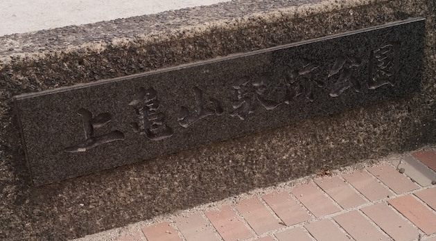
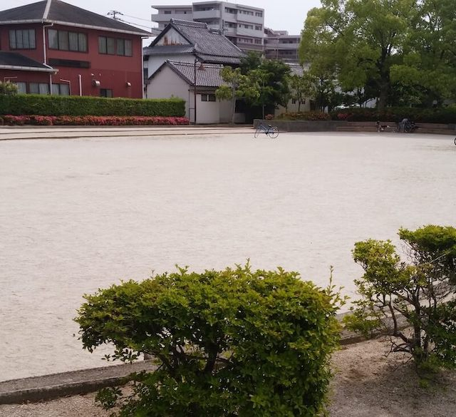
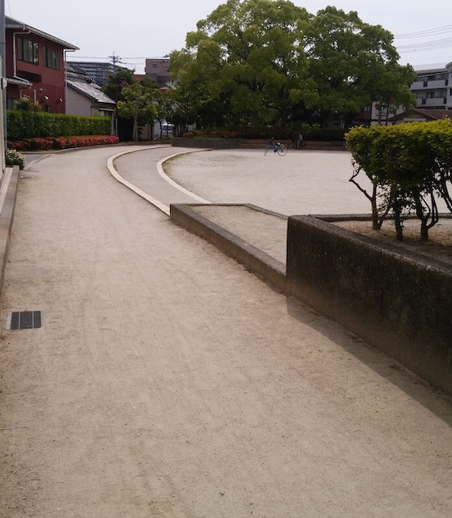
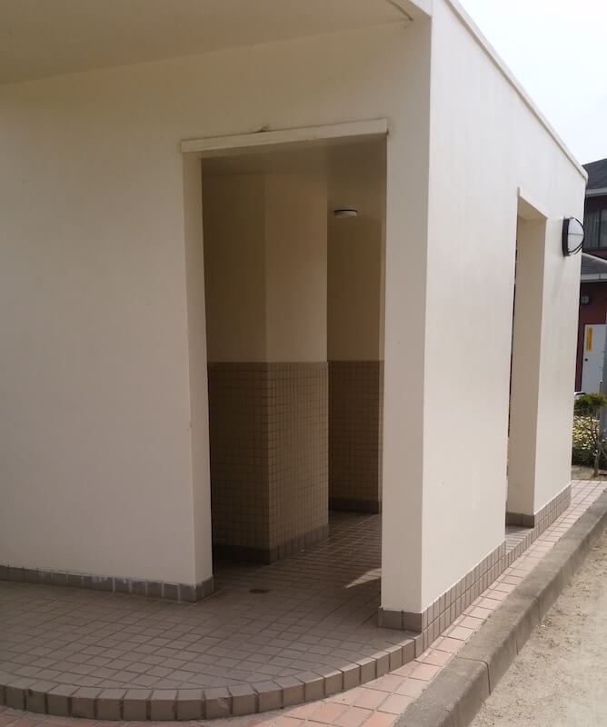

ホントに何もない。
最寄り駅：柚須  
福岡県糟屋郡志免町別府１丁目２１−２５  
トイレ：あり。男女共用。オムツ替え不可。   
　  
## 特徴
小さめの広場が１つあるだけ。  
元々は駅だったらしい。  
わざわざ足を運ぶ必要はなさそうです。

## 入口
  

## 広場
  

## 道
  

## トイレ
  

## 地図
<iframe src="https://www.google.com/maps/embed?pb=!1m14!1m8!1m3!1d13292.447748176683!2d130.4596659!3d33.6024!3m2!1i1024!2i768!4f13.1!3m3!1m2!1s0x0%3A0xc9c2b4a392a0a5af!2sKamikameyamaekiato+Park!5e0!3m2!1sen!2sjp!4v1560099774568!5m2!1sen!2sjp" width="600" height="450" frameborder="0" style="border:0" allowfullscreen></iframe>