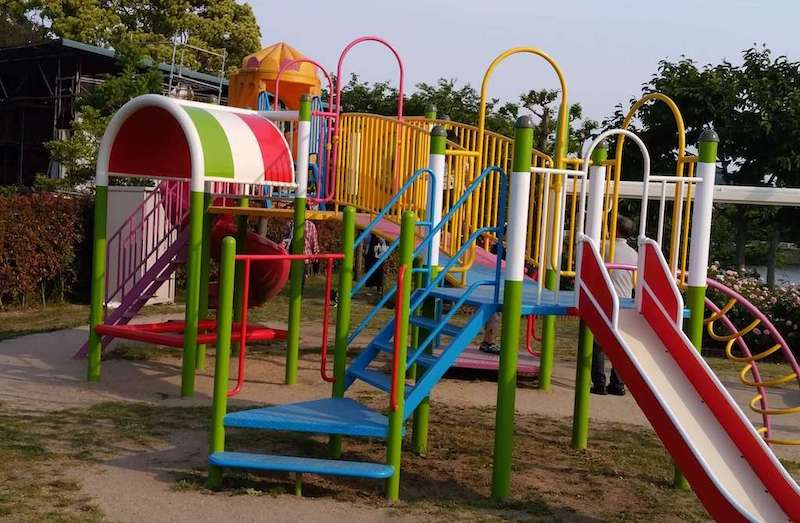
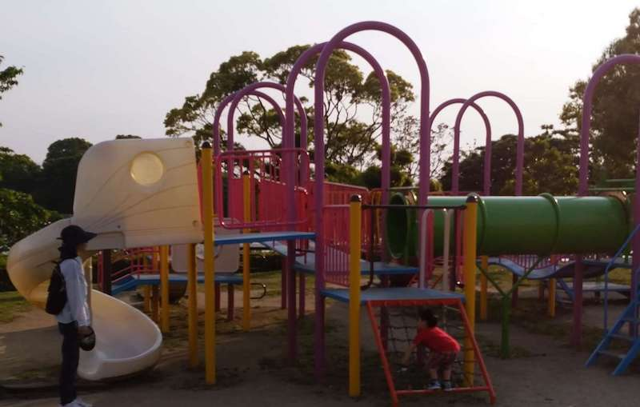
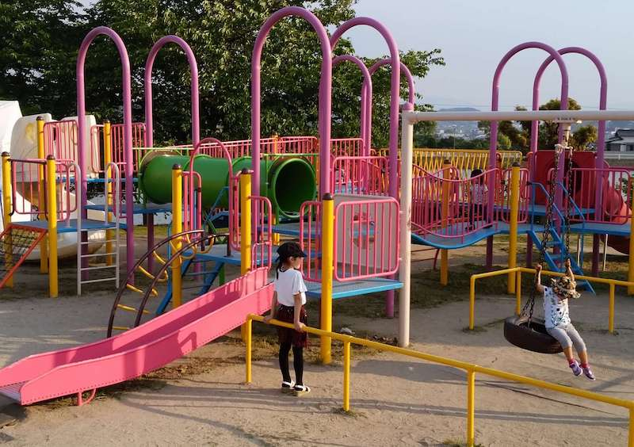
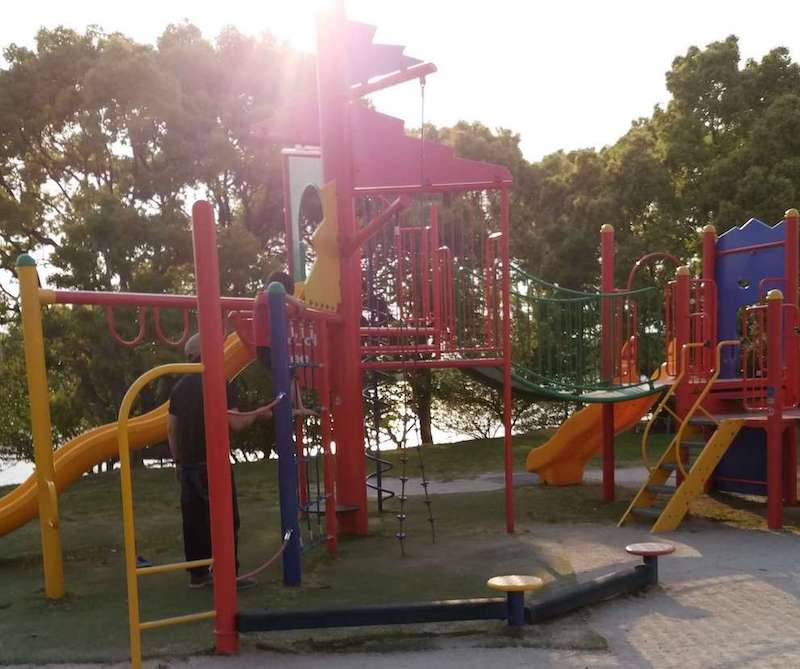
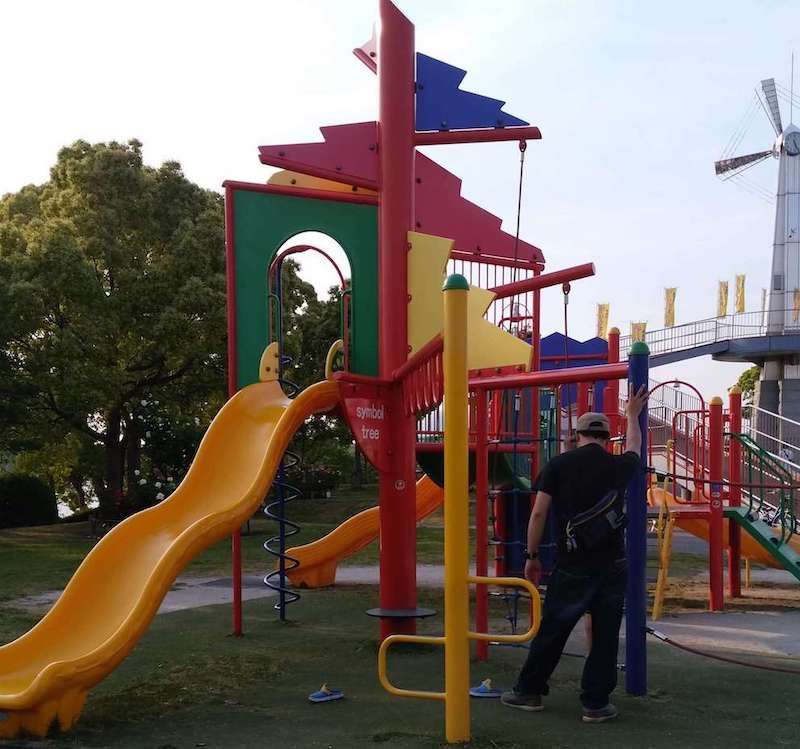

最寄り駅：長者原/酒殿  
福岡県糟屋郡粕屋町駕与丁3丁目2-1  
めっさ広いけど、子供ば遊ぶ場所は少なめ。  
　  
## 特徴
お花がいっぱい咲いてます。    

## 遊具１

## 遊具２
  

## 遊具３
  

# 地図
<iframe src="https://www.google.com/maps/embed?pb=!1m14!1m8!1m3!1d5878.14813784377!2d130.48133765259016!3d33.60776495912711!3m2!1i1024!2i768!4f13.1!3m3!1m2!1s0x0%3A0xef53456f938dcfd4!2z5bGV5pyb5YWs5ZyS!5e0!3m2!1sja!2sjp!4v1558027519003!5m2!1sja!2sjp" width="600" height="450" frameborder="0" style="border:0" allowfullscreen></iframe>

