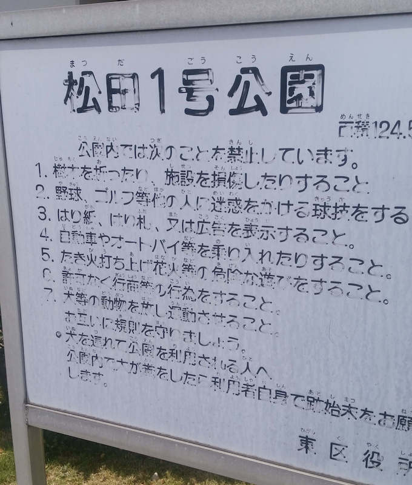
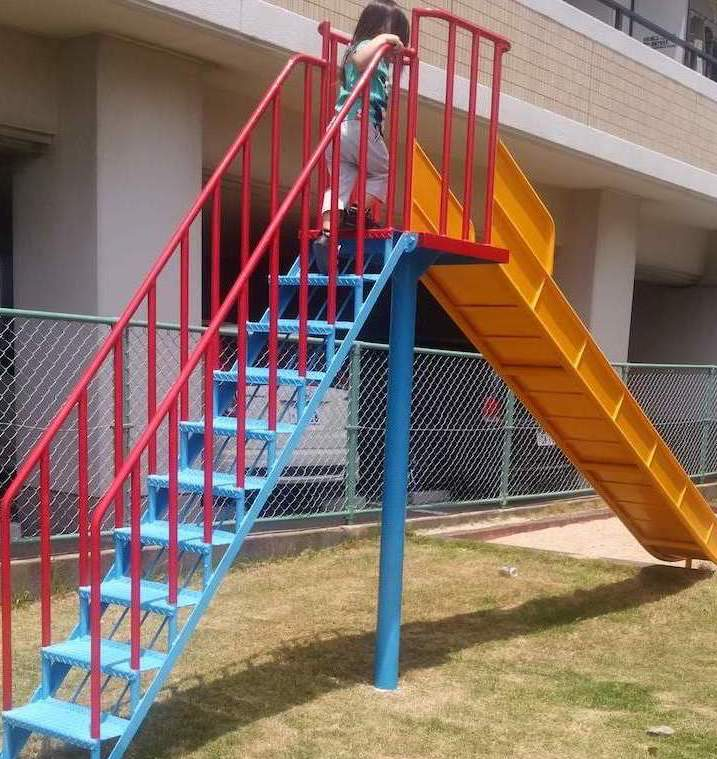
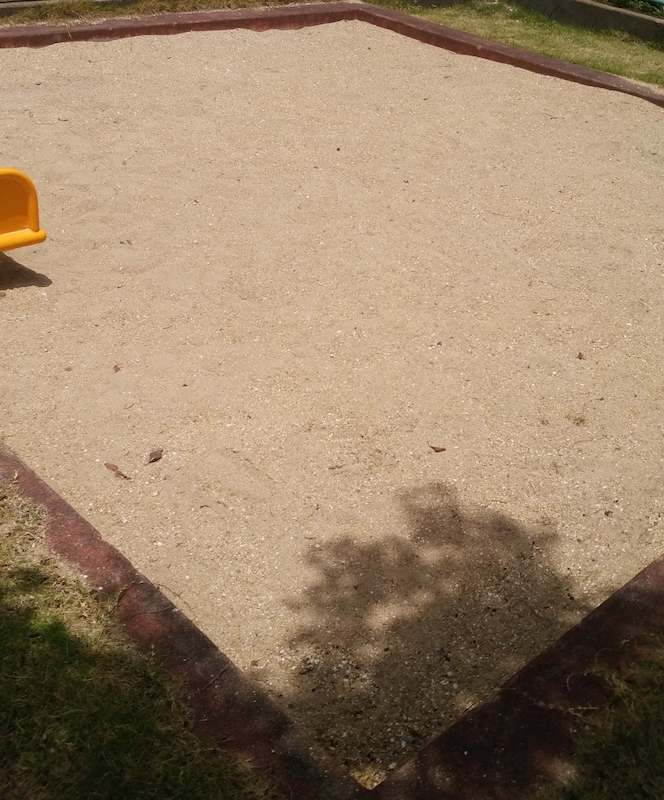
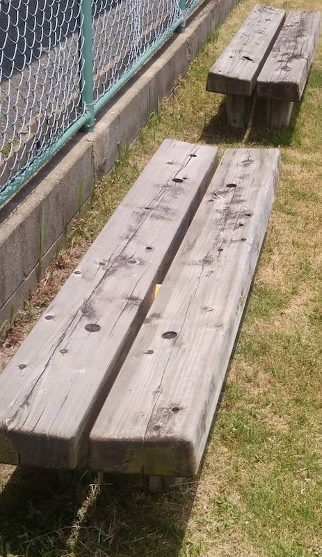

一見、マンション付属の公園っぽい。  
すっごく小さい。  
最寄り駅：柚須  
福岡県福岡市東区東区松田３丁目９  
トイレ：なし  
　  
## 特徴
小さすぎて親子共々、楽しめないので、近くの[松田東公園](../../matsudahigashi-park/matsudahigashi-park/)か、[柚須公園](../../yusu-park/yusu-park/)がおすすめ。

## 看板
  

## 滑り台
  

## 砂場

## ベンチ

## 地図
<iframe src="https://www.google.com/maps/embed?pb=!1m14!1m8!1m3!1d13290.488976425502!2d130.4474205!3d33.6151046!3m2!1i1024!2i768!4f13.1!3m3!1m2!1s0x0%3A0x28b0e40aabee44ec!2sYusu+Park!5e0!3m2!1sen!2sjp!4v1558870241394!5m2!1sen!2sjp" width="600" height="450" frameborder="0" style="border:0" allowfullscreen></iframe>
