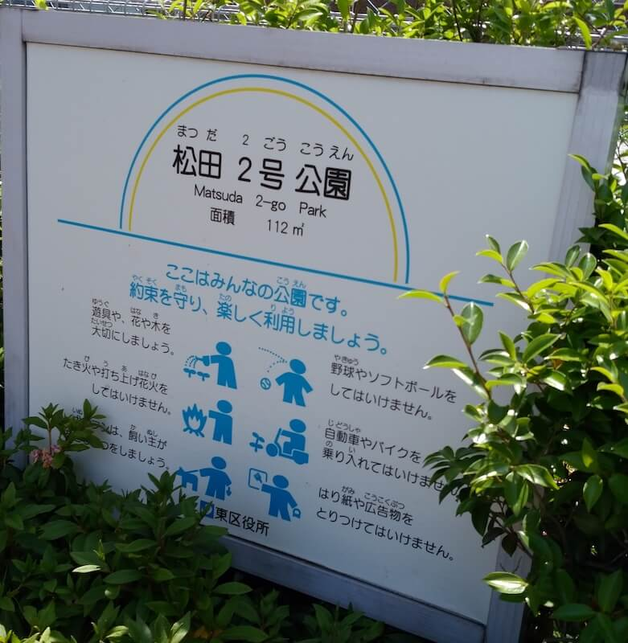
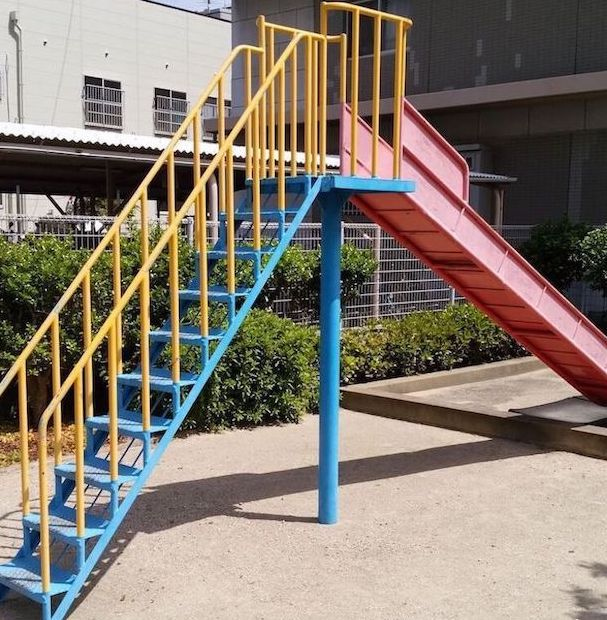
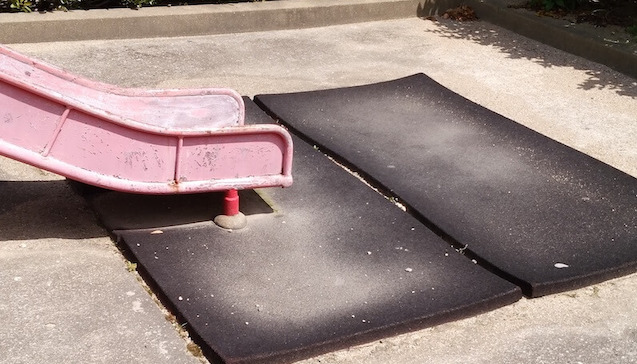
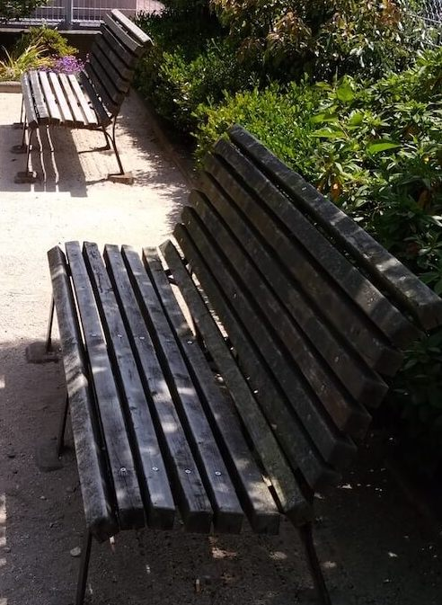

一見、マンション付属の公園っぽい。  
もっっのすごく小さい。  
最寄り駅：柚須  
福岡県福岡市東区東区松田３丁目１２  
トイレ：なし  
　  
## 特徴
小さすぎて親子共々、楽しめないので、近くの[松田東公園](../../matsudahigashi-park/matsudahigashi-park/)か、[柚須公園](../../yusu-park/yusu-park/)がおすすめ。

## 入口
  

## 滑り台
  

## ベンチ

# 地図
<iframe src="https://www.google.com/maps/embed?pb=!1m18!1m12!1m3!1d3322.5818489334533!2d130.44767106108583!3d33.61615242369222!2m3!1f0!2f0!3f0!3m2!1i1024!2i768!4f13.1!3m3!1m2!1s0x35418fbf3f09fc3f%3A0x7f7323543e103cd6!2sMatsuda+2+Go+Park!5e0!3m2!1sen!2sjp!4v1558151635154!5m2!1sen!2sjp" width="600" height="450" frameborder="0" style="border:0" allowfullscreen></iframe>
