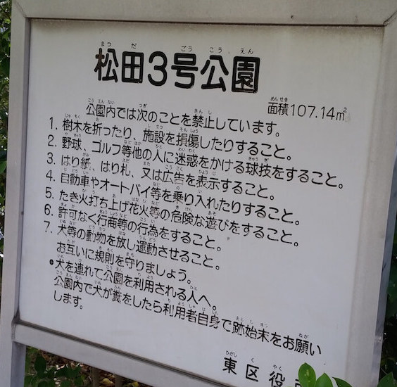
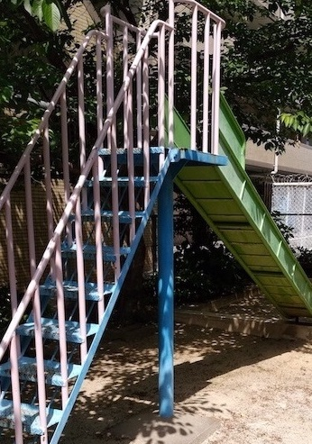
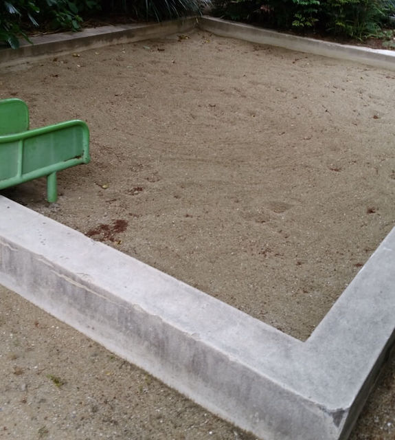
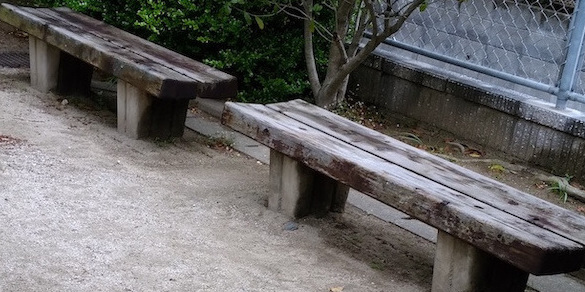

一見、マンション付属の公園っぽい。  
むちゃくちゃ小さい。  
最寄り駅：柚須  
福岡県福岡市東区松田３丁目８  
トイレ：なし  
　  
## 特徴
小さすぎて親子共々、楽しめないので、近くの[松田東公園](../../matsudahigashi-park/matsudahigashi-park/)か、[柚須公園](../../yusu-park/yusu-park/)がおすすめ。

## 入口
  

## 滑り台

## 砂場

## ベンチ

# 地図
<iframe src="https://www.google.com/maps/embed?pb=!1m18!1m12!1m3!1d1661.2835546947542!2d130.44459674945975!3d33.616534750398856!2m3!1f0!2f0!3f0!3m2!1i1024!2i768!4f13.1!3m3!1m2!1s0x0%3A0xd9a45e2e2f6df94d!2sMatsuda+3+Go+Park!5e0!3m2!1sen!2sjp!4v1558214575619!5m2!1sen!2sjp" width="600" height="450" frameborder="0" style="border:0" allowfullscreen></iframe>
