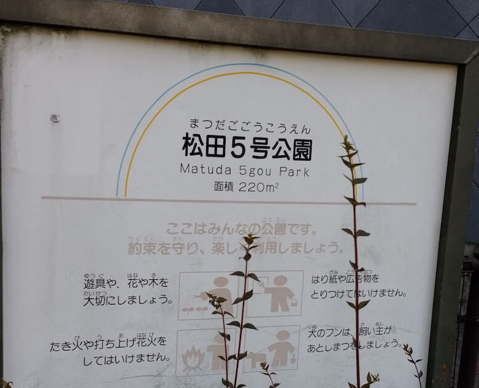
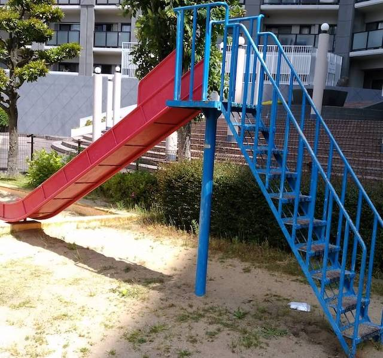

そこそこの広さ。    
最寄り駅：柚須  
福岡県福岡市東区東区松田３丁目１７
トイレ：なし  
　  
## 特徴
小さすぎて親子共々、楽しめないので、近くの[松田東公園](../../matsudahigashi-park/index/)か、[柚須公園](../../yusu-park/index/)がおすすめ。

## 看板
  

## 滑り台
  

## 砂場

## 入口

# 地図
<iframe src="https://www.google.com/maps/embed?pb=!1m18!1m12!1m3!1d3772.461619308187!2d130.4471253994657!3d33.618096986640964!2m3!1f0!2f0!3f0!3m2!1i1024!2i768!4f13.1!3m3!1m2!1s0x35418fbf03afcd9f%3A0x908846f6870b4686!2sMatsuda+4+Go+Park!5e0!3m2!1sen!2sjp!4v1559486919926!5m2!1sen!2sjp" width="600" height="450" frameborder="0" style="border:0" allowfullscreen></iframe>
