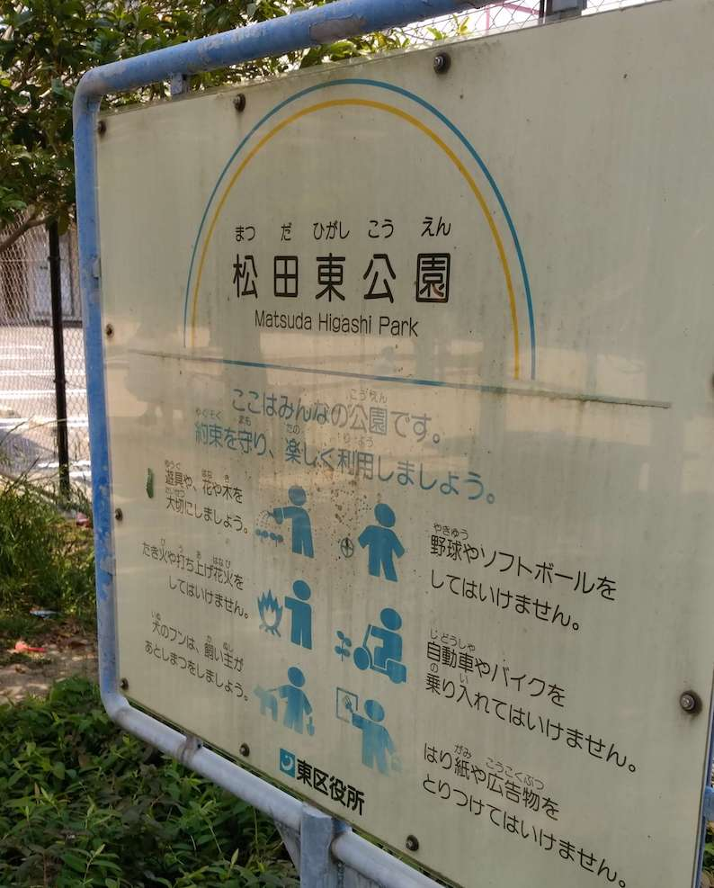
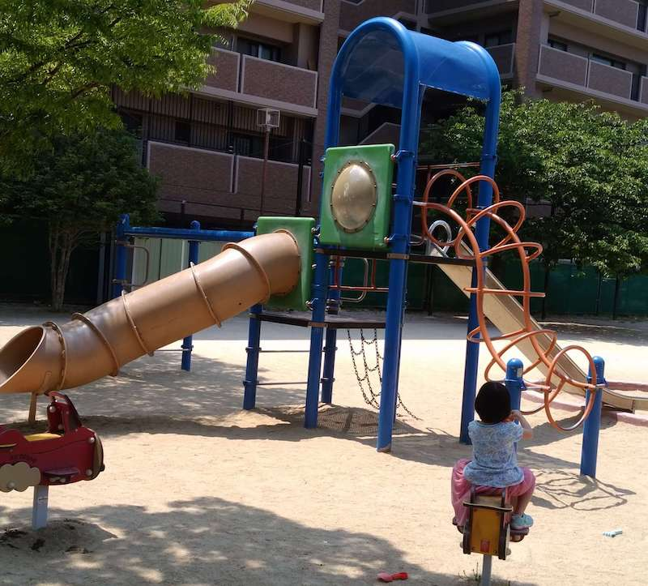
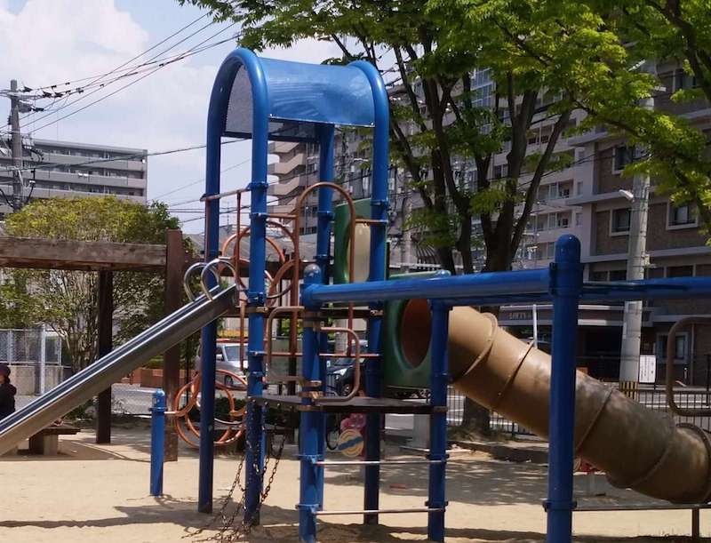
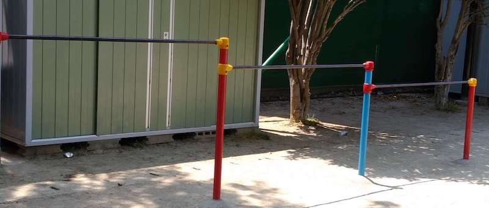
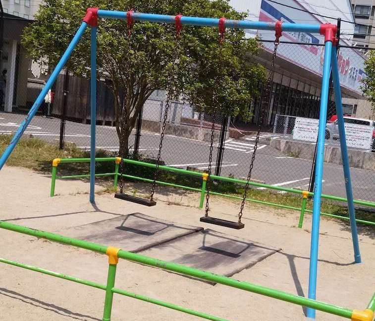
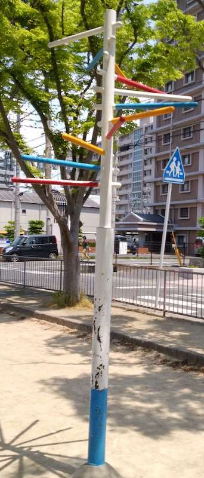
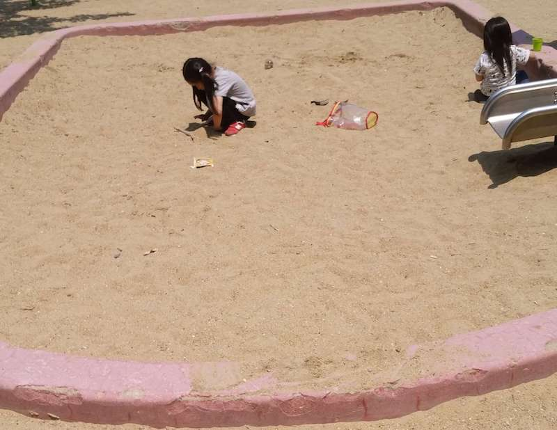
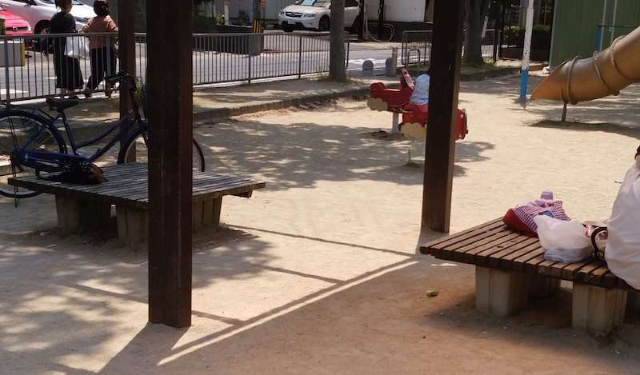
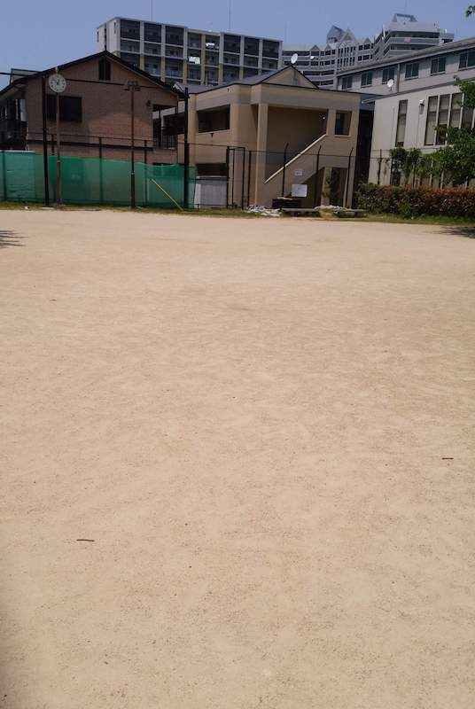

そこそこの広さ。    
最寄り駅：柚須  
福岡県福岡市東区松田3丁目11  
トイレ：なし  
　  
## 特徴
あまり広くはないですが、結構、賑わってる印象です。

## 入口

## 遊具
  

## 鉄棒

## ブランコ

## ぶら下がり健康器

## 砂場

## ベンチ

## グラウンド

# 地図
<iframe src="https://www.google.com/maps/embed?pb=!1m18!1m12!1m3!1d1613.9682924162337!2d130.44559193944016!3d33.61769819776702!2m3!1f0!2f0!3f0!3m2!1i1024!2i768!4f13.1!3m3!1m2!1s0x35418fb8b435f1b9%3A0x9765e360b706ebde!2z5p2-55Sw5p2x5YWs5ZyS!5e0!3m2!1sja!2sjp!4v1558027742820!5m2!1sja!2sjp" width="600" height="450" frameborder="0" style="border:0" allowfullscreen></iframe>