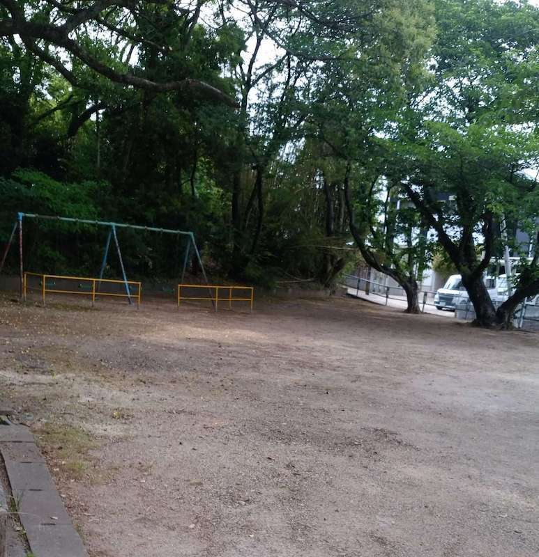

妙に薄暗いです。  
最寄り駅：柚須  
福岡県糟屋郡志免町別府西２丁目１０−６   
トイレ：なし   
　  
## 特徴
撮影した日は気温が 30度を越えていたのですが、妙に薄暗くて薄寒かった。  
連れて行ったウチの子は、終始僕から離れませんでした。
　  
結構入り組んだ場所にあり、遊具も寂れているので、わざわざ足を運ぶ必要はなさそうです。  

## 入口
  

## 広場
  
妙に薄暗いですが、撮影時間は 15時～16時くらい。 
  
  

## すべり台
  

## ブランコ
  

## 砂場
  

## 風景
  

## 地図
<iframe src="https://www.google.com/maps/embed?pb=!1m18!1m12!1m3!1d3323.072481941269!2d130.45896556520327!3d33.60342378073038!2m3!1f0!2f0!3f0!3m2!1i1024!2i768!4f13.1!3m3!1m2!1s0x35418fe673ea3ff1%3A0xcf4268f91d895dc0!2z5Yil5bqc5YWQ56ul5YWs5ZyS!5e0!3m2!1sen!2sjp!4v1561280254166!5m2!1sen!2sjp" width="600" height="450" frameborder="0" style="border:0" allowfullscreen></iframe>
