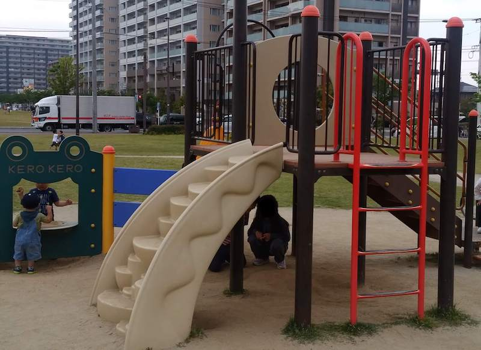

IKEAの近く。  
新宮町中央駅前二丁目3番  
最寄り駅：新宮中央  
広い。  
トイレ：あり。オムツ替え可。  

## 特徴
キャスターボードやダンスをしている人もちらほら。  
水遊び可。  

## 広場 
  

## 水遊び

## 遊具１
  

## 遊具２
  
  

# 地図
<iframe src="https://www.google.com/maps/embed?pb=!1m18!1m12!1m3!1d3318.9353103250687!2d130.45016271516226!3d33.71062278070028!2m3!1f0!2f0!3f0!3m2!1i1024!2i768!4f13.1!3m3!1m2!1s0x35418860852307d7%3A0xac4d3994a5034003!2z5rKW55Sw5Lit5aSu5YWs5ZyS!5e0!3m2!1sja!2sjp!4v1558027787851!5m2!1sja!2sjp" width="600" height="450" frameborder="0" style="border:0" allowfullscreen></iframe>