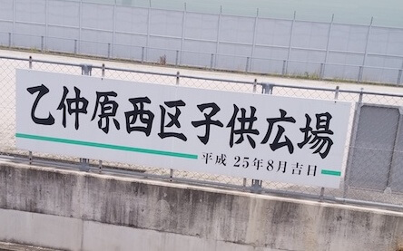
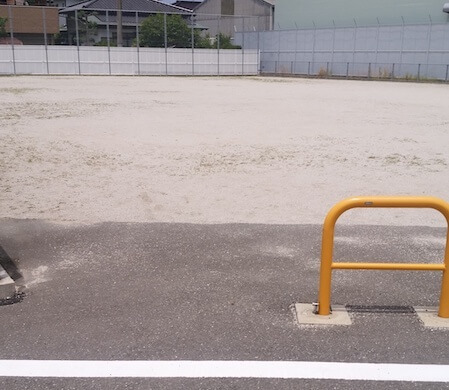
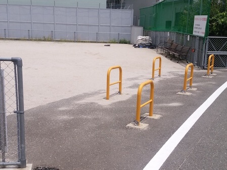

特に何もありません。  
最寄り駅：柚須  
トイレ：なし。   
　  
## 特徴
ただの広場です。    
サッカーやフットベースができるくらいでしょうか。  

## 入口
  

## 広場
  
  

## 地図
（データ取得できませんでした）
だいたいこの辺。
https://www.google.com/maps/@33.6116069,130.4544984,19.95z  

