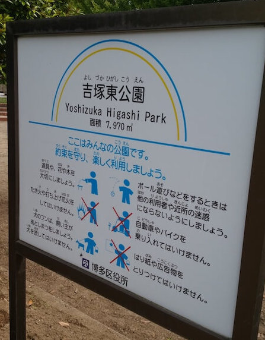
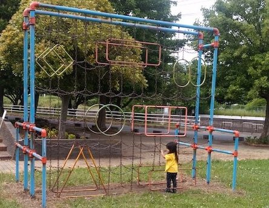
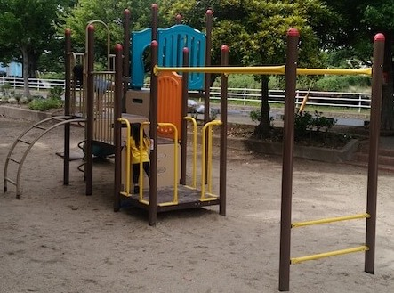
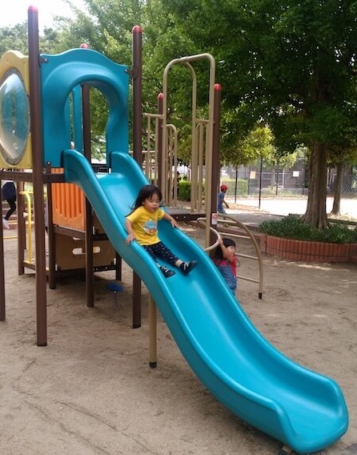
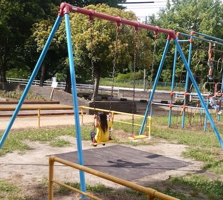
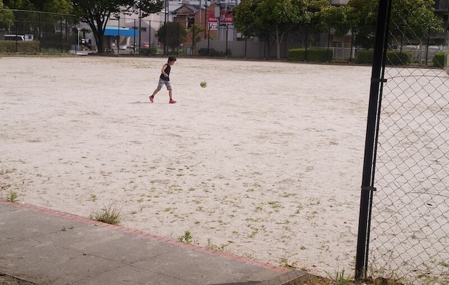
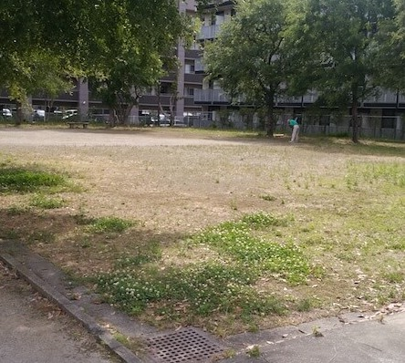
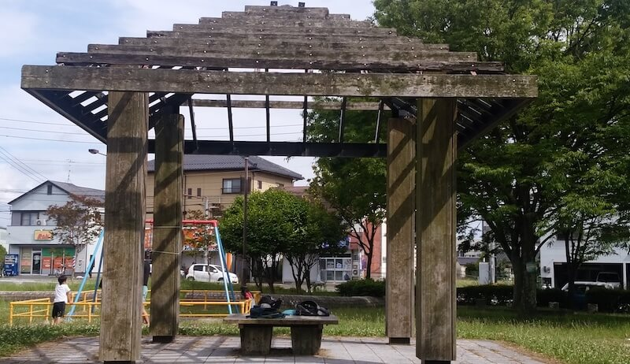
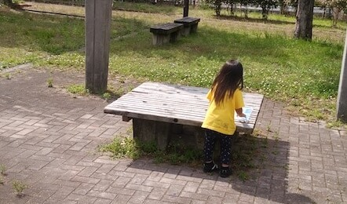
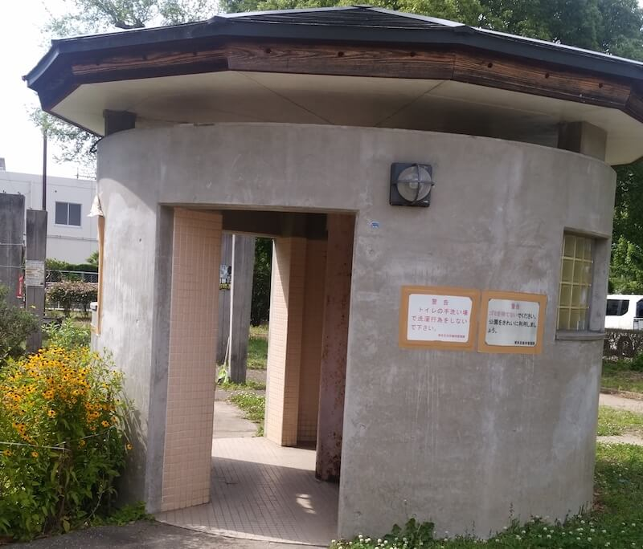

休日は賑わってる印象です。  
最寄り駅：吉塚  
福岡県福岡市博多区吉塚７丁目２   
トイレ：あり。 オムツ替え不可。   
　  
## 特徴
幅広い年齢層の方々が居る印象です。  
  

## 入口
  

## 遊具１
  

## 遊具２
  
  

## ブランコ
  

## 広場
  
  

## ベンチ
  
  

## トイレ
  

## 地図
<iframe src="https://www.google.com/maps/embed?pb=!1m18!1m12!1m3!1d3156.9824207720258!2d130.43229277110967!3d33.60766234904706!2m3!1f0!2f0!3f0!3m2!1i1024!2i768!4f13.1!3m3!1m2!1s0x0%3A0x92417d35a9a08004!2sYoshizukahigashi+Park!5e0!3m2!1sen!2sjp!4v1564959166000!5m2!1sen!2sjp" width="600" height="450" frameborder="0" style="border:0" allowfullscreen></iframe>
