そこそこの広さ。    
最寄り駅：柚須  
福岡県福岡市東区松田3丁目11  
トイレ：なし 　  

## 特徴
あまり広くはないですが、結構、賑わってる印象です。

## 入口
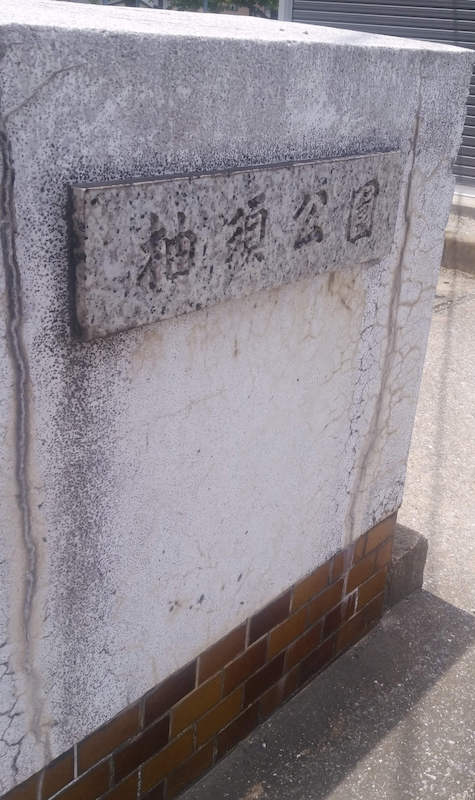  
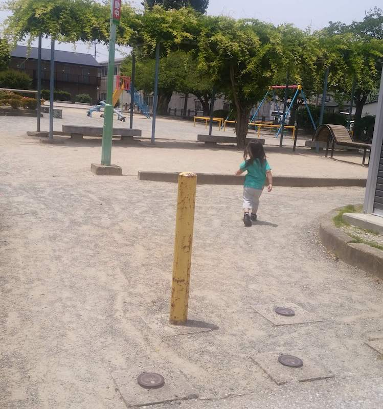  

## 滑り台
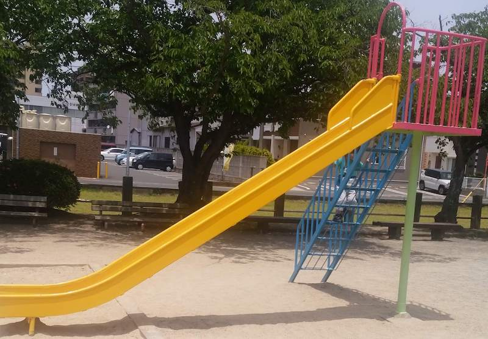  

## 砂場
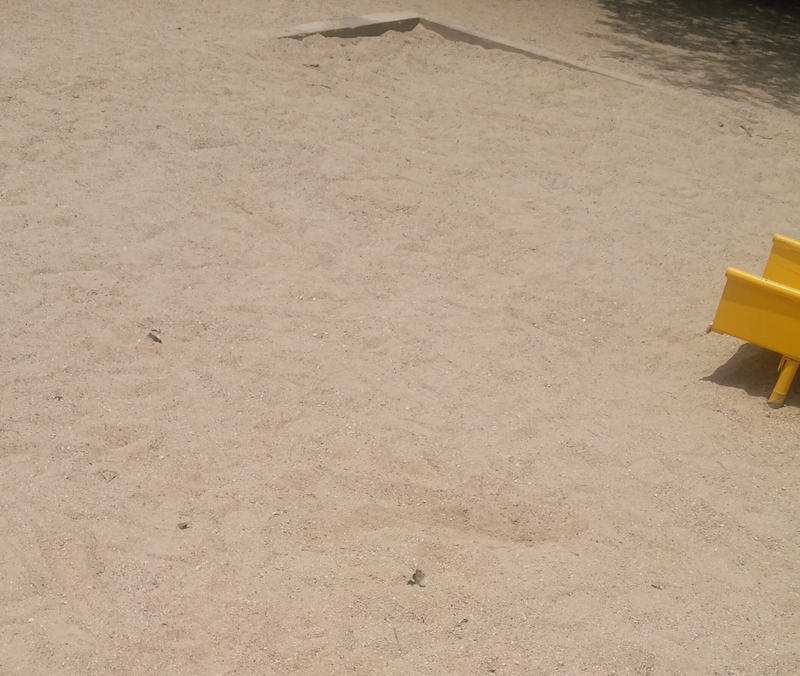  

## ブランコ
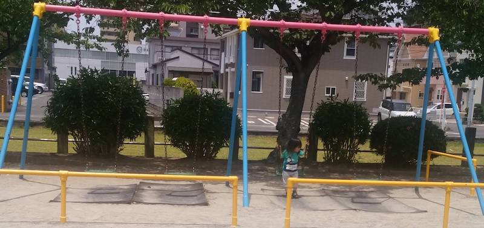  

## シーソー
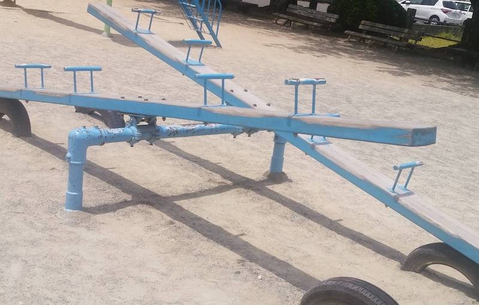  

## 乗り物
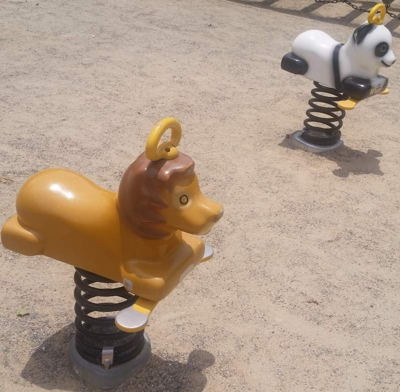  

## 遊具
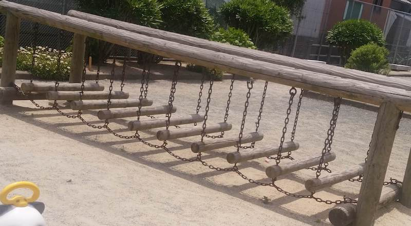  

## 広場
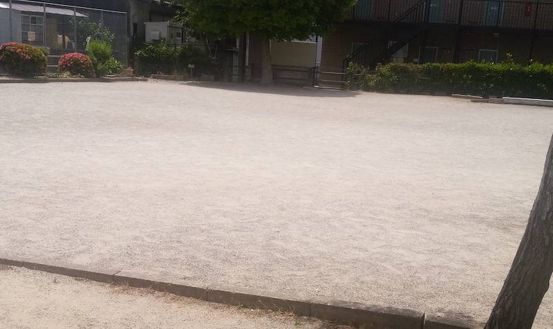  

## ベンチ
  
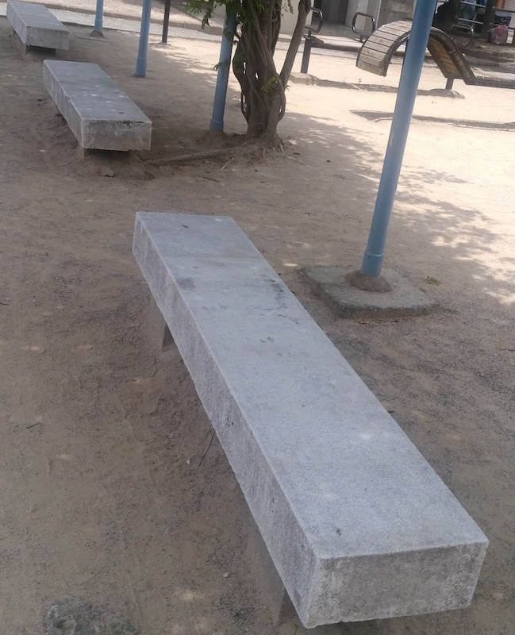  

## トイレ
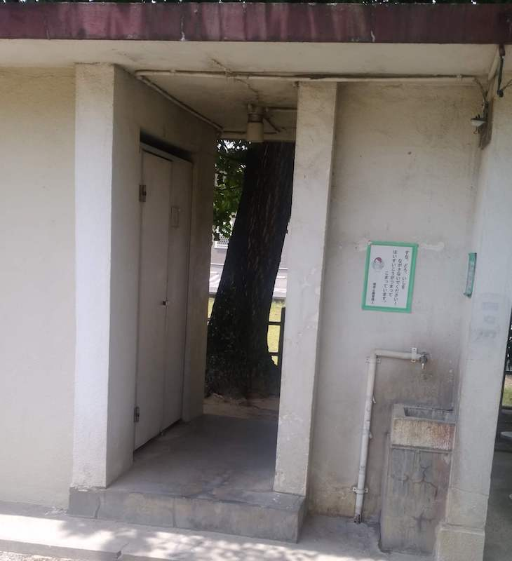  

# 地図
<iframe src="https://www.google.com/maps/embed?pb=!1m18!1m12!1m3!1d8068.53726851925!2d130.44507291468386!3d33.616022530079704!2m3!1f0!2f0!3f0!3m2!1i1024!2i768!4f13.1!3m3!1m2!1s0x35418fc74e4cdc25%3A0xf70a588322399980!2sMatsuda+1+Go+Park!5e0!3m2!1sen!2sjp!4v1558868194269!5m2!1sen!2sjp" width="600" height="450" frameborder="0" style="border:0" allowfullscreen></iframe>
